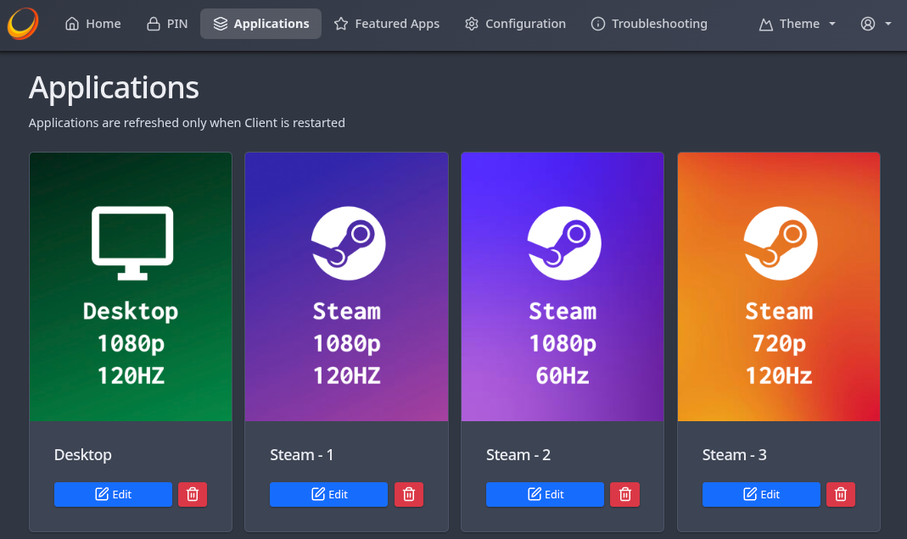

# Virtual Display Guide: CachyOS (KDE + Limine)

Based on [this guide](https://www.azdanov.dev/articles/2025/how-to-create-a-virtual-display-for-sunshine-on-arch-linux) but tailored for CachyOS using KDE Plasma and the Limine bootloader.

This guide assumes you have already installed and are familiar with Sunshine.

### Tested Environment
- **OS:** CachyOS
- **Kernel:** 7.0.9-1-cachyos
- **KDE Plasma:** 6.6.5 (Wayland)
- **Limine:** 11.4.1-1
- **Sunshine:** 2026.516.143833

---

## Step 0: Clone the Repository

```bash
git clone https://github.com/<your-org>/sunshine-virtual-display.git
cd sunshine-virtual-display
```

---

## Step 1: Generate EDID File
Generate an EDID file using [edid.build](https://edid.build/). 

Click `+ Add mode` to define additional resolutions and refresh rates for your virtual display. 

**Tip:** Defining multiple modes (e.g., 4K/60Hz for a TV and 1080p/120Hz for a smartphone) allows you to create specialized Sunshine launch profiles for different client devices.

## Step 2: Place EDID File
```bash
sudo mkdir -p /usr/lib/firmware/edid
# Assuming the file was downloaded as edid.bin
sudo mv ~/Downloads/edid.bin /usr/lib/firmware/edid/
```

## Step 3: Configure Kernel Parameters

### 1. Identify GPU Ports
List all available GPU ports to find a suitable "virtual" target:
```bash
for p in /sys/class/drm/*/status; do con=${p%/status}; echo -n "${con#*/card?-}: "; cat $p; done
```

> [!WARNING]
> The port you choose will be dedicated to the virtual display and will no longer output to a physical monitor. In this guide, we use `HDMI-A-1`.

### 2. Update Limine Configuration
Edit your Limine default configuration:
```bash
sudo nano /etc/default/limine
```

Append the following to the `KERNEL_CMDLINE` variable: 
`drm.edid_firmware=HDMI-A-1:edid/edid.bin video=HDMI-A-1:e`

**Example configuration:**
```bash
ESP_PATH="/boot"
KERNEL_CMDLINE[default]+="quiet nowatchdog splash rw rootflags=subvol=/@ root=UUID=... drm.edid_firmware=HDMI-A-1:edid/edid.bin video=HDMI-A-1:e"
BOOT_ORDER="*, *lts, *fallback, Snapshots"
```

### 3. Regenerate Initramfs
Apply the kernel changes:
```bash
sudo limine-mkinitcpio
```

### 4. Reboot & Verify
Reboot your system, then verify the virtual display is active:
```bash
kscreen-doctor -o
```
Confirm that the `Modes` list matches your custom EDID configuration.

---

## Step 4: Create Sunshine Scripts
Automating monitor management ensures your physical displays turn off when a stream begins and turn back on when it ends. It also guarantees that your host renders the game using the same resolution and refresh rate as your streaming device.

1. Run `kscreen-doctor -o` to identify your physical ports (e.g., `DP-1`, `DP-2`) and take note of the **mode numbers** for your virtual display (e.g., `1` for `1:1920x1080@120` and `2` for `2:1280x720@60`).
2. Update the `Disable/Enable` sections in [stream-start.sh](./scripts/stream-start.sh) and [stream-stop.sh](./scripts/stream-stop.sh) with your specific physical port names.
3. The repo includes ready-made presets in [`scripts/presets/`](./scripts/presets/) (e.g., `stream-1080p-120.sh`, `stream-720p-60.sh`). Each calls `stream-start.sh` with a mode number corresponding to a resolution/refresh rate. **These mode numbers are examples based on my EDID** — check your own `kscreen-doctor -o` output and either edit the existing presets or create new ones for your specific resolutions.

---

## Step 5: (Optional) Custom Application Covers
Customize your Sunshine covers using the [Sunshine-Cover-Generator](https://ashdevfr.github.io/Sunshine-Cover-Generator/) or any other tool you prefer.



---

## Step 6: Configure Sunshine
You can configure applications via the web UI or by editing `$HOME/.config/sunshine/apps.json`.

### Config File
Add a new entry to `$HOME/.config/sunshine/apps.json`, setting the path to the `do` and `undo` scripts. Also set the path to the custom cover if you have one.

```json
{
  "apps": [
    {
      "name": "Steam - 1080p 120Hz",
      "image-path": "path/to/sunshine-virtual-display/covers/steam_1080p_120hz.png",
      "prep-cmd": [
        {
          "do": "",
          "undo": "setsid steam steam://close/bigpicture"
        },
        {
          "do": "path/to/sunshine-virtual-display/scripts/presets/stream-1080p-120.sh",
          "undo": "path/to/sunshine-virtual-display/scripts/stream-stop.sh"
        }
      ],
      "detached": [
        "setsid steam steam://open/bigpicture"
      ],
      "auto-detach": true,
      "exclude-global-prep-cmd": false,
      "exit-timeout": 5,
      "wait-all": true
    }
  ]
}
```

### Browser UI
Open the Sunshine web interface and navigate to the **Applications** tab. You can either create a new application or click **Edit** on an existing one.

In the **Command Preparations** section:
1. Add a new entry.
2. In **Do Command**, enter the path to your launch script (e.g., `/path/to/stream-1080p-120.sh`).
3. In **Undo Command**, enter the path to the shutdown script (e.g., `/path/to/stream-stop.sh`).

To add a custom cover, go to the **Image** section and set the path to your custom image file.